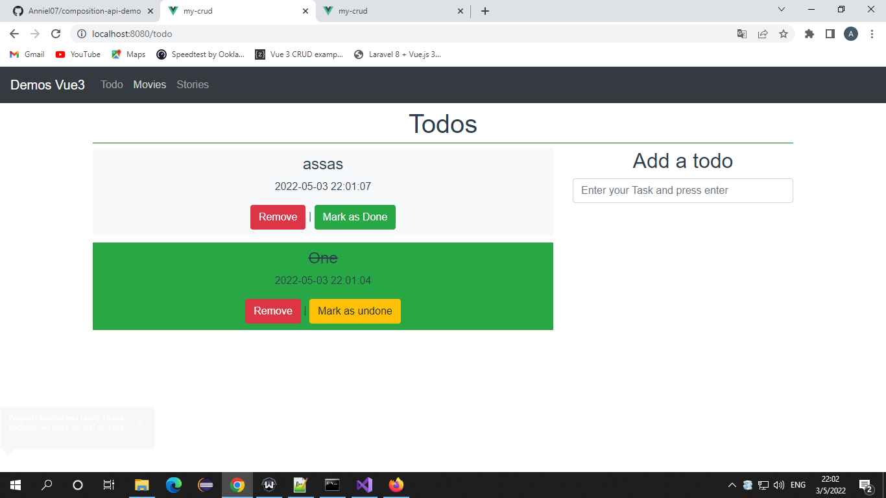

# my-crud
Pending make crud for Tutorials
## Project setup
```
npm install
```

### Compiles and hot-reloads for development
```
npm run serve
```

### Compiles and minifies for production
```
npm run build
```

### Lints and fixes files
```
npm run lint
```

### Some views



### Customize configuration
See [Configuration Reference](https://cli.vuejs.org/config/).
